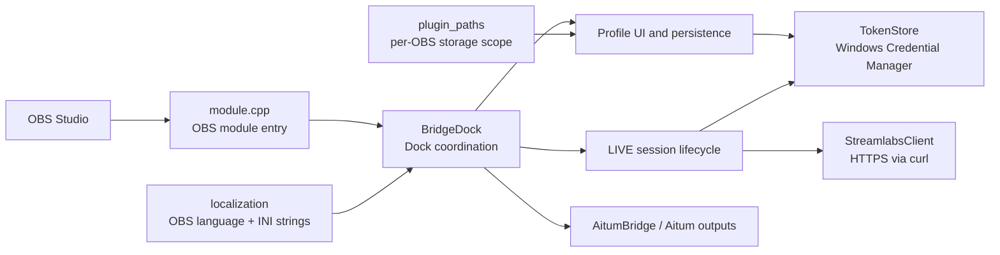

# Architecture

The plugin is intentionally split by responsibility. UI code does not own HTTP implementation, token persistence, or Windows installation scoping.

## Source layout

| Area | Files | Responsibility |
| --- | --- | --- |
| Module entry | `module.cpp` | Registers and removes the OBS dock. |
| Dock coordination | `bridge_dock.cpp`, `bridge_dock.hpp` | Aitum event interception, one-click start handling, output/account selection rules. |
| Profile UI | `bridge_dock_profiles.cpp`, `profile.hpp`, `profile_row.*` | Profile list, login/access state, persisted non-secret metadata. |
| Stream UI and lifecycle | `bridge_dock_streams.cpp` | Metadata input, LIVE creation/end, Aitum update, output verification, recovery. |
| Streamlabs transport | `streamlabs_client.*`, `streamlabs_desktop.*` | HTTPS requests and opt-in local Streamlabs Desktop token discovery. |
| Aitum integration | `aitum_bridge.*`, `aitum_outputs.*` | Aitum vendor requests and settings-dialog update path. |
| Platform boundaries | `plugin_paths.*`, `token_store.*`, `localization.*` | Windows installation scoping, Credential Manager, OBS locale selection. |

## Invariants

1. A TikTok account cannot be active or preparing in more than one local profile at once.
2. An Aitum output cannot be reserved by more than one profile at once.
3. A newly created LIVE session is kept reserved until Streamlabs confirms it ended, including error paths.
4. Aitum's accepted start request is not treated as proof of an active output; the output status is verified.
5. Tokens and generated credentials never enter the profile INI file or log output.
6. Each OBS installation has its own configuration scope; updates at the same path retain that scope.

## Change guidance

Before changing the flow, identify which invariant it affects. A feature that weakens an invariant needs an explicit safety argument and test coverage, not just a working UI path.
